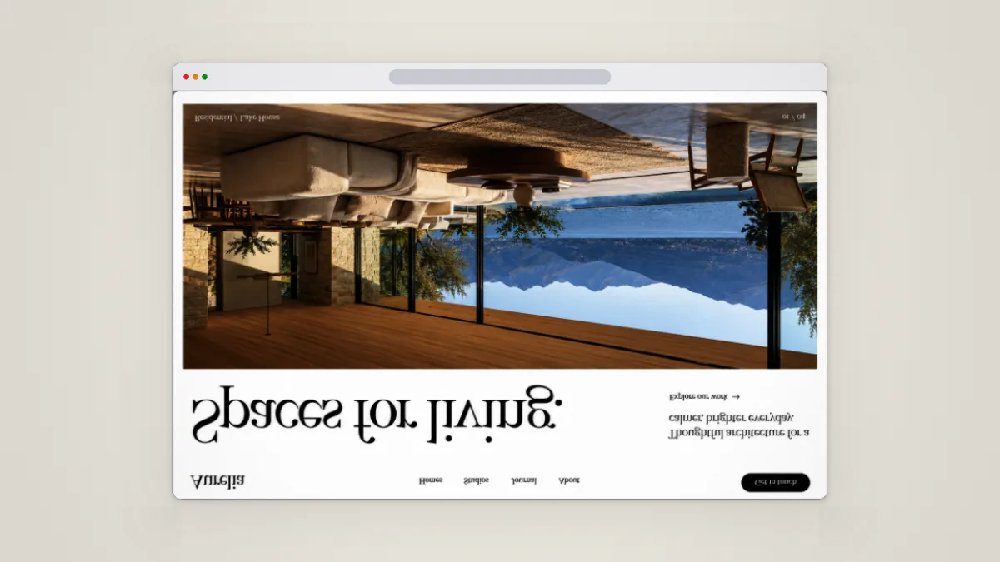
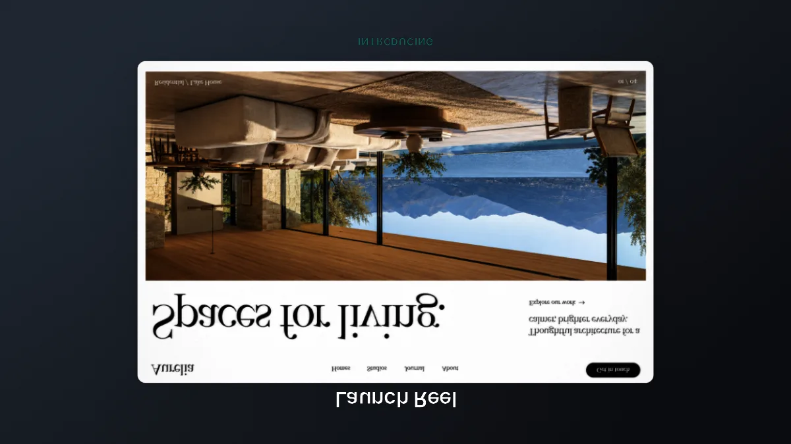
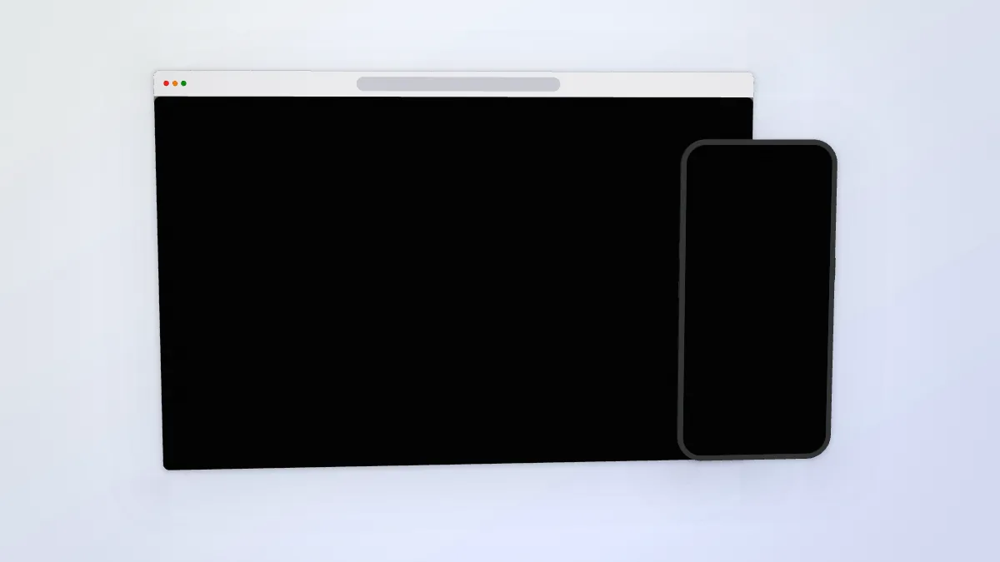
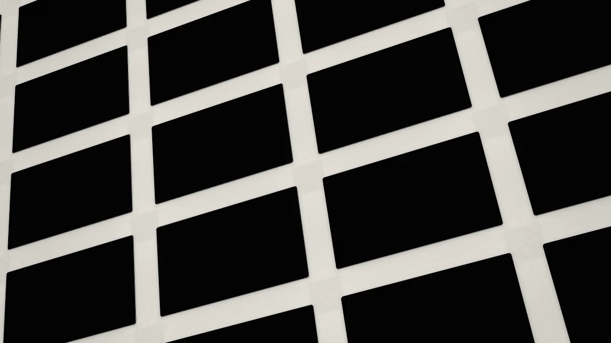
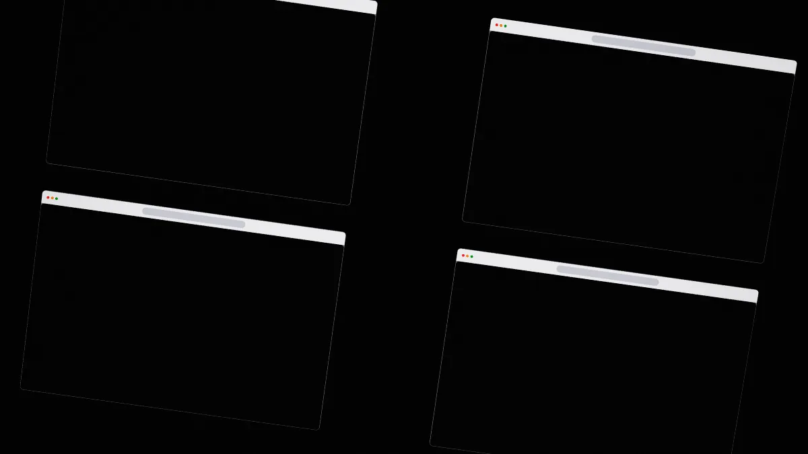
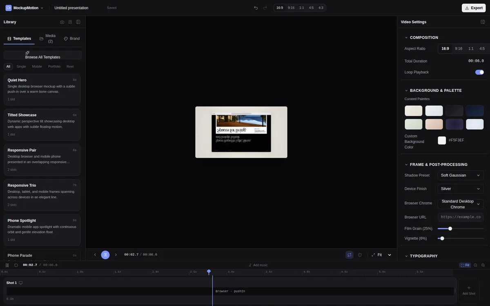
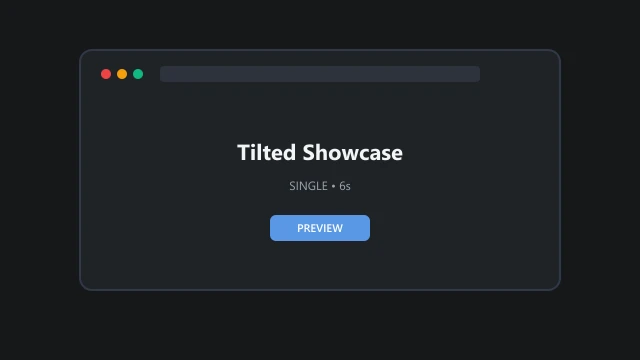
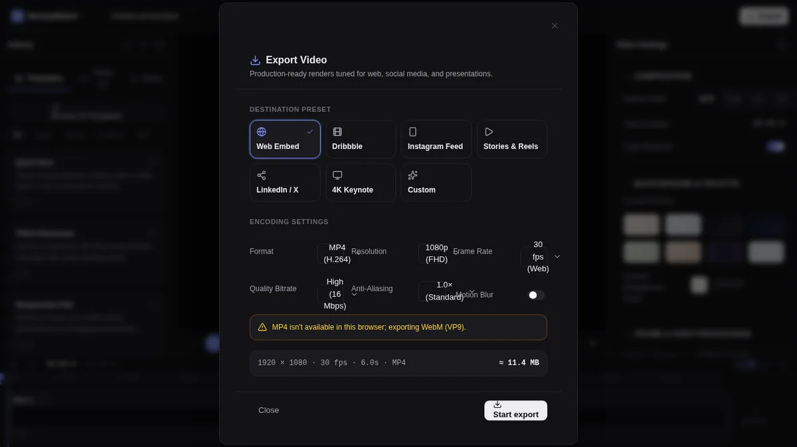

# MockupMotion fix plan (October 2026)

This plan is for the agent that will fix the rebuild that landed on `main` in commits `3b6eccf…51c1b5f` (WP-00 to WP-18). Read this file completely before touching code. Then do the tasks in `tasks/` **in order**.

The original architecture docs are still the source of truth for *what* to build:

- `docs/plan/contracts.md` (types and APIs)
- `docs/plan/quality-bar.md` (look and motion rules)
- `CLAUDE.md` (hard rules and code style; read it even if you are not Claude, because `AGENTS.md` points to it)

This plan says what is broken, why, and exactly how to fix and prove it.

---

## 1. Verdict

The rebuild has a reasonable skeleton: the module layout follows the contracts, it is deterministic, typecheck, lint and the 214 unit tests pass, and the demo sites are good. **The product does not work.** Every screenshot and every title renders upside down, most templates show black screens, colours are wrong, and the editor preview is a 300-pixel thumbnail. Several "verification" tests were written so they cannot fail, and all 19 work packages were marked Complete without anyone looking at the output.

Measured on `51c1b5f`, with Chromium on SwiftShader:

| Check | Result |
|---|---|
| `npm run typecheck`, `lint`, `build` | Pass |
| `npm test` (Vitest) | 214 / 214 pass |
| `npm run test:e2e` (Playwright, Chromium) | **10 of 70 fail**. Failing: "Start with a template", the full editor flow, all 5 audio specs, lab export, an MP4 spec, and the export-speed spike. |
| Visual regression (`test:visual`) | **Checks nothing**: no baselines are committed, and the spec returns early when a baseline is missing. |
| Orientation of screenshots and text | **Upside down** in preview, `/lab` and exported video |
| Colour of a solid `#808080` background | Renders `#373737` (expected `#808080`) |
| Colour of Graphite `#18191B` | Renders `#020303`, effectively black |
| Templates with more than one screenshot | **Black screens.** Screenshots never load for pair, trio, rows, columns, wall or stack. |

## 2. What is broken (evidence)

| # | Problem | Evidence | Root cause | Fix task |
|---|---|---|---|---|
| 1 | Screenshots render **upside down** (this is the "mirrored" look) |  and the exported file:  | `src/engine/textures/TextureManager.ts:117-126` wraps an `ImageBitmap` in `THREE.Texture` with the default `flipY = true`. WebGL **ignores** `UNPACK_FLIP_Y_WEBGL` for `ImageBitmap`, so the image is uploaded unflipped. The strip quads in `src/engine/materials/screen.ts:243-253` then map v=1 to the top, so the top of the screenshot lands at the bottom. | F01 |
| 2 | Titles and captions render upside down |  | `src/engine/text/TextPass.ts:265-275` uses `v = 1 - y`, which assumes the bitmap was flipped on upload. It was not (same `ImageBitmap` rule). | F01 |
| 3 | Pair, trio, rows, columns, wall and stack show **black screens** |   | `Engine.setDocument` (`src/engine/Engine.ts:251-258`) preloads textures only when `shot.layout.kind === "single"`. Every other layout gets `null` and draws the empty fill. The export worker uses the same Engine, so exports are black too. | F03 |
| 4 | Colours are wrong: mid-tones are too dark and dark palettes turn black |   | No engine shader converts its output to sRGB. `src/engine/post/final.ts:188` writes linear values straight to the canvas. The gradient and mesh shaders (`BackgroundRenderer.ts:82,155`) output **sRGB** into sRGB render targets, so they look right only because two errors cancel. Solids and screenshots come out too dark. | F02 |
| 5 | Editor preview is a ~300 px thumbnail and upside down |  | `src/editor/stage/Stage.tsx:288-296` sets `width`/`height: auto` with `aspect-ratio` and no definite size, so the canvas falls back to its default 300×150 box. | F05 |
| 6 | Preview playback rebuilds the whole scene every frame | — | `src/engine/react/EngineCanvas.tsx:109-116` lists `playhead` in the dependencies of the `setDocument` effect. While playing, `setDocument` runs every frame: it destroys and recreates every device and re-rasterizes text. The playback effect also restarts every frame, and playback ignores `doc.loop`. | F05 |
| 7 | "Start with a template" does nothing | e2e `polish.spec.ts:19` fails | `src/editor/EditorShell.tsx:285-288` only opens the Library panel if it is closed, and it is open by default. | F06 |
| 8 | Template "previews" are fake |  | `public/templates/*.webp` are 4 KB placeholder cards containing the template name and a fake "PREVIEW" button. `scripts/template-previews.ts` swallows errors (`.catch(() => {})`) and writes "fallback posters". No `.webm` previews exist. | F07 |
| 9 | `/lab`, contact sheets and visual tests always show the same image | — | `src/lab/asset-provider.ts:13` returns `/demo/aurelia.png` for **every** asset id. Fixture metadata is also wrong (aurelia is declared as 1440×3600; it is 1586×992). | F04 |
| 10 | Export dialog layout is broken, and its summary says MP4 while the warning says WebM |  | `src/editor/export/ExportModal.tsx`: controls are squeezed into a 4-column grid, and the summary prints the *requested* format instead of the *probed* one. | F09 |
| 11 | Music preview drifts 0.9 s from the video (target: < 40 ms) | e2e `audio.spec.ts:124` | `src/editor/audio/useAudioPreview.ts` does not re-sync the audio source on seeks and scrubs. | F10 |
| 12 | Tests that cannot fail | — | `tests/e2e/spike.spec.ts:63`: `maxChannelDiff = Math.max(maxChannelDiff, 0)`, which is always 0. `tests/e2e/devices.spec.ts:47-96`: "width-fit" renders but never reads a pixel. `tests/visual/stills.spec.ts:50-58`: passes silently when no baseline exists. The `spike.spec.ts` "fps" test times CPU submission without a GPU sync. | F00, F13 |
| 13 | Ambient background is not blurred and is stretched | — | `BackgroundRenderer.ts`: `ambientBlurTargets` is never filled. The shader samples strip 0 stretched to the frame with no cover-fit. | F11 |
| 14 | Templates mostly use flat solid colours instead of the designed palettes and meshes | — | `src/templates/*.ts` (see F11's table) | F11 |
| 15 | Timeline shot cards have no thumbnails and show internal ids ("Browser · pushIn"). The drop hint shows node ids ("Assign media to row1:col3"). | screenshots in the F08 task | `ShotCard.tsx:276`, `Stage.tsx:359` | F07, F08 |
| 16 | The status-bar pin squashes the whole first texture strip into the 5.5% status-bar area | — | `screen.ts:280-298` maps the full strip texture with no UV sub-range. | F01 |
| 17 | The Playwright suite cannot launch in cloud sessions | — | `@playwright/test@1.63` needs Chromium build 1243. The image ships 1194, and `playwright.config.ts` has no override. | F00 |

**What is good and must be kept:**

- The module structure (`doc/ state/ storage/ motion/ engine/ templates/ export/ ui/ editor/`).
- Determinism and module boundaries (no `Date.now` or `Math.random` in motion and engine, no three.js in `editor/`).
- The pure motion code (`src/motion/*`) and its tests.
- Storage with blobs stored once.
- The demo sites (`demo-sites/`) and the capture CLI.
- The Radix-based UI kit.
- The Mediabunny worker export.

Do not rewrite these. Fix them.

**Ignore the `master` branch.** It holds an unrelated React-Three-Fiber prototype with no shared history.

## 3. Rules for the executor (read twice)

The previous run failed mainly because work was marked done without being looked at, and tests were bent until they passed. These rules exist to stop that.

1. **Look at the output.** Every visual task requires PNG stills you rendered yourself at ≥ 1200 px wide from `/lab?still=1&fixture=…&w=1200`. Open them, check them against `quality-bar.md`, and commit them under `docs/fix-plan/evidence/Fxx/`. Describe in one sentence per image what you checked.
2. **A test must be able to fail.** For every new or rewritten assertion that guards a fix, revert the fix locally, run the test, and paste the failing output into the task's PR description. Then restore the fix. A test that passes both ways is not a test.
3. **Never weaken a test to make it pass.** Never delete an assertion, loosen a tolerance, add `skip`, or return early. Do this only where the task says a test is wrong. If a test cannot pass, stop and write down why.
   - The only allowed skip: an MP4/H.264 assertion when `canEncodeVideo("avc")` is false in that browser. It must be `test.skip(true, "H.264 encoder unavailable in this Chromium build")`, decided at runtime.
4. **No silent fallbacks in scripts or tests.** No `.catch(() => {})`, no empty `catch {}`, no "fallback placeholder" assets. Scripts exit non-zero on any failure. (F00 adds a lint rule for this.)
5. **No placeholder assets.** If a generated asset (preview video, poster, thumbnail) cannot be produced, the task is not done.
6. **Run every gate before you say a task is done:** `npm run typecheck && npm run lint && npm test && npm run build && npm run test:e2e`. Paste the pass/fail counts. Once F13 is done, also run `npm run test:visual`.
7. **Status is evidence-based.** Mark a task `Done` in the table below only after its acceptance criteria are met *and* the evidence is in the repo or PR.
8. **Stay in scope.** List anything else you notice under "Follow-ups" in the task's PR.
9. **One task per branch and PR**, named `fix/Fxx-<slug>`. Commit messages start with `Fxx:`.

## 4. Tasks (do them in this order)

| Task | Title | Size | Depends on | Status |
|---|---|---|---|---|
| [F00](tasks/F00-test-harness.md) | Test harness that can't lie (Playwright setup, pixel helpers, lint bans) | M | — | Done |
| [F01](tasks/F01-image-orientation.md) | Image orientation: screenshots, text, cursor, backgrounds, status bar | M | F00 | Done |
| [F02](tasks/F02-color-pipeline.md) | Colour pipeline: linear working space, sRGB output, exact colours | M | F00 | Done |
| [F03](tasks/F03-asset-loading-and-engine-diffing.md) | Load assets for every layout, engine diffing, texture cache | M | F01 | Done |
| [F04](tasks/F04-lab-real-assets.md) | `/lab` and template previews use real demo assets | S | F03 | Done |
| [F05](tasks/F05-stage-and-playback.md) | Stage sizing and preview playback loop | M | F03 | Done |
| [F06](tasks/F06-first-run-and-templates.md) | First run and template flow | S | F05 | Done |
| [F07](tasks/F07-previews-and-thumbnails.md) | Real template previews, shot and project thumbnails | M | F04, F06 | Done |
| [F08](tasks/F08-ui-polish.md) | Inspector and editor UI polish | M | F06 | Done |
| [F09](tasks/F09-export.md) | Export dialog and export correctness | M | F03 | Done |
| [F10](tasks/F10-audio-sync.md) | Music preview sync and audio specs | S | F05 | Done |
| [F11](tasks/F11-art-direction.md) | Template art direction, ambient blur, chrome details (**user review gate**) | L | F01–F04 | Done |
| [F12](tasks/F12-demo-sites.md) | Demo site fixes and recapture | S | — | Done |
| [F13](tasks/F13-visual-regression-and-ci.md) | Visual baselines and CI that runs everything | M | F11 | Done |
| [F14](tasks/F14-docs-truth.md) | Make docs and statuses truthful | S | all | Done |

F12 is independent and can be done at any time. Everything else is sequential. F01 and F02 both touch shaders, so do them one after the other, not at the same time.

## 5. Prompt for the executor

Use this prompt for each task, changing `Fxx`:

```
You are fixing MockupMotion, a local-first web app (React + three.js + Mediabunny) that turns
website screenshots into presentation videos.

Read, in order: AGENTS.md, CLAUDE.md, docs/fix-plan/README.md (all of it, especially section 3
"Rules for the executor"), docs/plan/contracts.md, docs/plan/quality-bar.md, then
docs/fix-plan/tasks/Fxx-*.md.

Do task Fxx only. Follow its "Required changes" and meet every acceptance criterion. Before
writing code, reproduce the bug and save the evidence. After the fix, prove each guarding test
fails when you revert the fix. Render and inspect the stills the task asks for and commit them
under docs/fix-plan/evidence/Fxx/. Run all gates (typecheck, lint, test, build, test:e2e) and
report the pass/fail counts. Update the task's status in docs/fix-plan/README.md only when the
evidence exists. Open one PR named "Fxx: <title>" whose description lists every acceptance
criterion with its evidence.
```

## 6. Definition of done (whole plan)

- Every template renders right side up, with correct colours and real screenshots, at 16:9, 9:16, 1:1, 4:5 and 4:3, in the preview and in exported MP4/WebM. Verified by pixel tests and by committed stills.
- The editor preview fills the stage. Playback is smooth, and the preview never calls `setDocument` per frame.
- "Start with a template", demo content, apply template, edit, undo/redo and export all work end to end (e2e green).
- All e2e specs pass. Visual baselines are committed and CI runs unit, e2e and visual tests on every PR.
- The user has signed off on the F11 contact sheet.

## 7. Known issues and follow-ups

Every follow-up noted in the F00–F14 pull requests that is still open is collected in [`docs/plan/follow-ups.md`](../plan/follow-ups.md), with its source task and one line each. The work-package statuses and their known gaps are in [`docs/plan/README.md`](../plan/README.md). The per-template quality review is in [`docs/plan/quality-review.md`](../plan/quality-review.md), and what was run in which browser is in [`docs/plan/browser-matrix.md`](../plan/browser-matrix.md).

Safari and Firefox are out of scope for now (decided 7 Oct 2026), so the definition of done in §6 ("every template renders right side up … in exported MP4/WebM") is proven in Chromium only.
