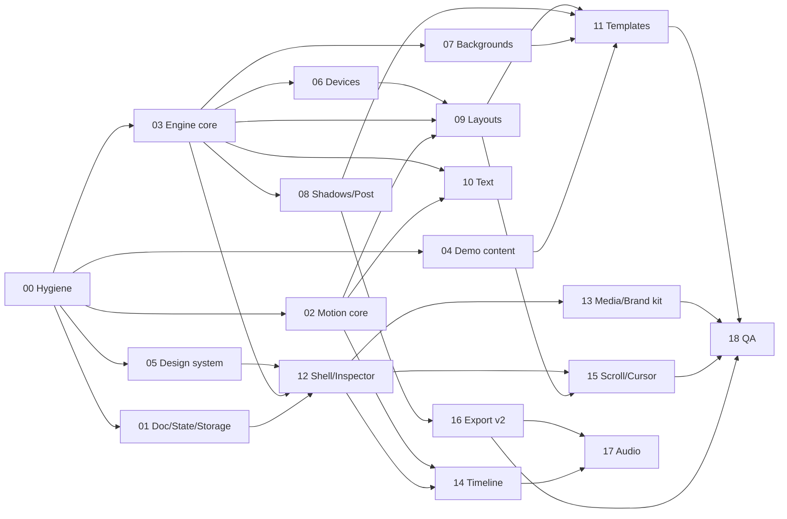

# MockupMotion rebuild plan

**Goal:** turn website screenshots into short, elegant presentation videos (Jitter / shots.so quality) that a web designer is proud to put on their site, Dribbble, or social. The app stays local-first: no server, no account, no watermark.

**Status of v0.1:** the plumbing works (upload, autosave, undo, and a fast WebCodecs export), but the output is not usable. Motion is nearly invisible and yo-yos, everything is flat 2D, phone screenshots are cropped, device frames look like placeholders, and the demo content looks like wireframes. The full findings with file and line references and screenshots are in [`audit.md`](audit.md).

**Approach:** keep the export pipeline and local-first data, and replace the renderer, motion model, templates, and editor UI. Rendering moves to **three.js** (real perspective, depth, and soft light). Motion becomes a **pure, testable timeline of shots with camera moves**. A written [quality bar](quality-bar.md) encodes the taste so every agent produces the same calm, premium result.

| Doc | What it is |
|---|---|
| [`audit.md`](audit.md) | What is wrong with v0.1 and what is worth keeping |
| [`contracts.md`](contracts.md) | Shared types and APIs, the source of truth for all lanes |
| [`quality-bar.md`](quality-bar.md) | Motion, layout, light, color, and type rules, with numbers |
| [`wp/`](wp) | 19 self-contained work packages for subagents |

---

## 1. Recommendations

### Add

| Feature | Why it matters for presenting web design work |
|---|---|
| **3D stage with a long-lens camera** (tilt, orbit, push-in, isometric) | This is the single biggest jump in perceived quality. Flat 2D rotation reads as cheap. |
| **Real device frames:** browser (standard, minimal, none), generic phone, tablet, laptop, frameless card | Frames are visible in every frame of video, so they must look premium. |
| **Width-fit screen mapping** | Website screenshots must never be cropped on the sides. |
| **Camera move library + easing vocabulary** (push-in, orbit, tilt, rise, dolly, iso drift; gentle, smooth, expo, spring) | Motion that settles and holds is what reads as "thoughtful." |
| **Shots + storyboard timeline with transitions** (fade, blur, push, zoom, wipe) | Case-study reels: title → hero → scroll → responsive → logo. One-shot loops still work. |
| **Scroll Story** (explicit template): scroll stops on a tall page with eased segments and holds | The most natural way to show a whole website. Opt-in only, never automatic. |
| **12 curated templates** with slot auto-fill and real animated previews | The fastest path to a good result. Replaces the 8 presets. |
| **Atmosphere:** mesh gradients, ambient blurred-screenshot backgrounds, OKLCH palettes, auto palette from the screenshot, film grain, vignette | Elegant backgrounds. Grain also removes H.264 banding. |
| **Two-layer soft shadows** tinted by the background, contact shadows on tilted layouts | Grounds devices without looking like a drop-shadow filter. |
| **Typography:** curated font pairs (self-hosted), custom font upload, kinetic text (fade-up, mask reveal, blur-in, word stagger) | Titles and end cards with the designer's own brand fonts. |
| **Brand kit:** logo, colors, fonts saved once and reused | Consistency across every video for the studio. |
| **Cursor overlay** with click ripples (optional, per shot) | Shows interactions without screen recording. |
| **Export v2:** destination presets (Website embed, Dribbble 4:3, Instagram, LinkedIn/X, 4K), supersampling, optional motion blur, **web-embed bundle** (MP4 + WebM + poster + `<video>` snippet), GIF, PNG | Built for the designer's actual destinations, especially their own website. |
| **4:3 aspect** | Dribbble's classic shot size (1600 × 1200). |
| **Capture CLI** (`npm run capture <url>`): full-page desktop (1440) and mobile (390 @2×) screenshots via Playwright | Getting good full-page screenshots is half the job. This runs locally on the designer's machine. |
| **Polished demo content:** static demo sites captured to real full-page screenshots | First impressions, template previews, and the test fixtures for visual regression. |
| **Multiple projects** and a project list | A studio has more than one client. |
| **Render lab** (`/lab`, dev only) and **contact sheets** | Lets agents and you review every template × aspect × time at a glance. |
| *(Optional, M3)* **Music track** with fades | Common for social. Kept last because it is the least essential. |

### Remove

| Remove | Reason |
|---|---|
| Canvas 2D renderer (`src/rendering/`) | It cannot do perspective, and it hardcodes the bugs. Replaced by `src/engine/` + `src/motion/`. |
| Ping-pong ("yo-yo") loop motion, the 2.4% zoom, and the 18 px drift | Reads as broken. Replaced by camera moves, marquee periods, and the wrap crossfade. |
| `src/utils/sampleImages.ts` (Canvas-drawn wireframe demos) | Replaced by captured demo sites. |
| The 8 presets and the flat `Composition` model | Replaced by templates that build shots with typed, layout-specific settings. |
| 2D "Rotation" and ±7% "Alignment" sliders; px shadow blur/offset sliders; diagonal "Reflection" | Replaced by the camera and shadow presets. The reflection washes out the screenshot. |
| MediaRecorder real-time export fallback | Non-deterministic, and unnecessary given WebCodecs in all 2026 target browsers. |
| Bottom media strip and the "Preset › Preview" breadcrumb | They duplicate the library and compete with the canvas. The storyboard timeline takes the space. |
| Preset favorites | Unnecessary with 12 curated templates plus "My templates". |
| Native `<select>` and `<input type=color>`, the 1,715-line `index.css`, and the unused Tailwind import | Replaced by a design system: Tailwind v4 tokens + Radix primitives. |
| Google Fonts CDN, AI Studio leftovers (`metadata.json`, `DISABLE_HMR`, `@` alias to root, `experimentalDecorators`, `allowJs`) | Hygiene. Local-first means self-hosted fonts. |

### Keep

Mediabunny export in a worker with codec probing, the "doc + time + size → frame" contract, IndexedDB local-first storage, undo transactions, image validation, and `public/demo/aurelia.png`.

---

## 2. Should we use three.js? Yes, for the renderer only

**Why three.js:**

- Perspective is the look you are after. Tilted browsers, isometric walls, floating phones, and orbiting cameras need a real camera, and Canvas 2D only supports affine transforms. Faking perspective in 2D (mesh warping) gives worse quality for more work.
- **GPU quality features come cheap:** mipmapped and anisotropic screenshot textures (crisp text at angles), MSAA, supersampling, soft shadows via shaders, grain and dither, mesh-gradient shaders, transitions as shader blends, and motion blur by accumulation.
- **It runs in the export worker.** `OffscreenCanvas` + WebGL2 works in Chrome, Edge, Firefox, and Safari 17+. The same `Engine` code renders the preview and every exported frame, so preview always matches export.
- **It is mature, well-documented, and tree-shakable** (current release r186). Agents know it well, so they make fewer mistakes than with an exotic stack.

**How (decisions agents must follow):**

| Decision | Choice | Why |
|---|---|---|
| Renderer | `three` with **`WebGLRenderer` (WebGL2)** | Predictable readback for encoding and worker support everywhere. Revisit `WebGPURenderer` after M3. |
| React binding | **None.** Plain three.js inside a framework-agnostic `Engine` class | The same code must run in a worker with a deterministic `renderAt(t)`. React Three Fiber adds a reconciler and frame loop we would fight. Borrow ideas from drei (ContactShadows, RoundedBox) without the dependency. |
| Animation | **Our own pure evaluator** (`src/motion/`) with cubic-bezier and spring easing | Animations are serializable data in templates and projects, and unit-testable in Node. GSAP and Theatre.js are imperative, mutable timelines that do not serialize into project files. |
| Text | **Rasterize on the main thread** (Canvas 2D at output resolution) → `ImageBitmap` → texture or screen-space quad | Exact web-font rendering, any user font, and no font loading in the worker. `troika-three-text` only if we later need per-glyph 3D text. |
| Post-processing | **Our own small final pass** (grain, vignette, dither, downsample, transition blend) + MSAA render targets | The `postprocessing` library is good, but parts of it (SMAA) rely on `Image` elements that do not exist in workers. We need about 150 lines of shader. |

**Gotchas the engine WP must handle** (details in WP-03): colorspace and tone mapping (screens must be color-exact), max texture size (tile tall screenshots), shimmering text (pre-downscale + mipmaps + anisotropy), WebGL context loss, `preserveDrawingBuffer` for encoder readback, and GPU memory disposal.

### Other libraries

| Library | Use | Notes |
|---|---|---|
| `three` | Engine | Import addons (e.g. `RoundedBoxGeometry`) from `three/addons/...` |
| `mediabunny` (keep) | Encode MP4/WebM, mux audio, verify outputs (`Input`) | Already working |
| `zustand` + `immer` | Editor store; keeps the existing `history.ts` semantics | Replaces prop drilling through the 567-line `App.tsx` |
| `idb` | IndexedDB wrapper (projects, blobs, brand kits, user templates) | |
| `@radix-ui/react-*` | Accessible primitives: Slider, Popover, Select, Tabs, Dialog, Tooltip, Toggle Group, Dropdown, Context Menu | Styled with Tailwind tokens |
| `tailwindcss` v4 (already installed) | Styling via `@theme` tokens | Actually use it, and delete `index.css` |
| `react-colorful` | Color picker inside a Radix Popover | 2 KB |
| `@dnd-kit/core` + `@dnd-kit/sortable` | Reorder media and timeline shots | |
| `culori` | OKLCH palettes, OKLab interpolation, contrast | |
| `bezier-easing` | Cubic-bezier solver | Tiny. Or hand-roll (about 40 lines) |
| `@fontsource-variable/*` | Self-hosted UI and curated title fonts | Inter, Instrument Serif, Fraunces, Geist, DM Sans/Serif, Space Grotesk |
| `fflate` | Zip the web-embed bundle | |
| `gifenc` | GIF export | |
| `vitest`, `@playwright/test`, `eslint` + `typescript-eslint` + `eslint-plugin-react-hooks` | Tests and linting | Replaces `node:test` and "lint = tsc" |

**Considered and rejected:** **Remotion** (rendering needs Node/Chromium or an experimental browser renderer, company licensing applies, and it would replace a working local pipeline); **Theatre.js** (heavy, slowing development, and imperative state); **GSAP** (excellent, but its imperative timelines do not serialize into projects); **PixiJS** (2D, no perspective camera without plugins); **React Three Fiber** (see above); **Lottie/Rive** (not needed for screenshot content).

---

## 3. Target architecture

```
          ┌──────────────── editor (React) ────────────────┐
 user ──▶ │ TopBar · Library · Stage · Timeline · Inspector │
          └──────┬───────────────────────────────┬─────────┘
                 │ zustand store (ProjectDoc v2) │ ui-store (selection, playhead)
                 ▼                               ▼
   templates ─▶ ProjectDoc ──▶ motion/evaluate(doc, t) ──▶ FrameState (pure data)
                 │                                              │
                 ▼                                              ▼
           storage (IndexedDB)                  engine/Engine.renderAt(t)  (three.js)
           projects · blobs · kits                │ preview: <canvas>, DPR-aware, on demand
                                                  │ export: OffscreenCanvas in worker
                                                  ▼
                                   export/encode (Mediabunny) ─▶ MP4 / WebM / GIF / PNG / bundle
```

- **`motion/` is the brain.** It is pure and holds all timing, easing, camera, layout, scroll, and text animation. It is unit-tested, including loop seams and framing limits.
- **`engine/` is the eyes.** It is three.js and only draws a `FrameState`. Preview and export share it.
- **`templates/`** are functions that build `{ style, shots, loop }` from slots. User templates use the same format.
- **Data:** `ProjectDoc` v2 (see `contracts.md` §2). Blobs are stored once per asset. v1 projects migrate automatically.

---

## 4. Milestones and work packages

| Milestone | Outcome you can see |
|---|---|
| **M1 · Looks right** | In `/lab`, every core template renders at Jitter-like quality and exports a crisp, seamless 1080p MP4. The old editor still runs. |
| **M2 · Feels like a pro tool** | The new dark editor with template gallery, media library, storyboard timeline, text, Scroll Story, cursor, and brand kit. The old UI and renderer are deleted. |
| **M3 · Ships** | Export destinations, web-embed bundle, GIF, 4K, optional audio, cross-browser QA, and visual regression. |

| WP | Title | Milestone | Depends on | Size | Status |
|---|---|---|---|---|---|
| [00](wp/WP-00-repo-hygiene-and-tooling.md) | Repo hygiene and tooling | M1 | — | S | Complete |
| [01](wp/WP-01-document-model-state-storage.md) | Document model v2, store, storage, migration | M1 | 00 | M | Complete |
| [02](wp/WP-02-motion-core.md) | Motion core: easing, camera, timeline, evaluate | M1 | 00 | M | Complete |
| [03](wp/WP-03-engine-core.md) | three.js engine core, preview, worker export, `/lab` | M1 | 00 | L | Complete |
| [04](wp/WP-04-demo-content-and-capture.md) | Demo sites, captured screenshots, capture CLI | M1 | 00 | M | Complete |
| [05](wp/WP-05-design-system.md) | Design system and UI primitives | M2 | 00 | M | Complete |
| [06](wp/WP-06-device-frames.md) | Device frames | M1 | 03 | M | Not started |
| [07](wp/WP-07-backgrounds-and-atmosphere.md) | Backgrounds, palettes, atmosphere | M1 | 03 | M | Not started |
| [08](wp/WP-08-shadows-and-post.md) | Shadows, anti-aliasing, final pass, motion blur | M1 | 03 | M | Not started |
| [09](wp/WP-09-layouts.md) | Layouts and camera framing | M1 | 02, 03, 06 | L | Not started |
| [10](wp/WP-10-text-and-typography.md) | Text and typography | M2 | 02, 03 | M | Not started |
| [11](wp/WP-11-templates-and-gallery.md) | Templates, slot filling, previews, contact sheet | M1 → M2 | 04, 06–09 (15 for Scroll Story; 10 and 14 for reels) | L | Not started |
| [12](wp/WP-12-editor-shell-and-inspector.md) | Editor shell and contextual inspector | M2 | 01, 03, 05 | L | Not started |
| [13](wp/WP-13-media-library-and-brand-kit.md) | Media library, roles, brand kit, projects, My templates | M2 | 01, 05, 12 | M | Not started |
| [14](wp/WP-14-storyboard-timeline.md) | Storyboard timeline and transitions | M2 | 02, 03, 12 | L | Not started |
| [15](wp/WP-15-scroll-story-and-cursor.md) | Scroll Story and cursor overlay | M2 | 09, 12 | M | Not started |
| [16](wp/WP-16-export-v2.md) | Export v2, destinations, web bundle, GIF | M3 | 03, 08 | M | Not started |
| [17](wp/WP-17-audio.md) | Music track (optional) | M3 | 14, 16 | S | Not started |
| [18](wp/WP-18-qa-and-polish.md) | Visual regression, e2e, performance, cross-browser, final polish | M3 | all | L | Not started |

Sizes: S ≈ half a day of agent work, M ≈ 1–2 days, L ≈ 2–4 days, each including verification.

### Dependency graph and parallel lanes



| Wave | Run in parallel |
|---|---|
| 1 | **00** (alone, short; it lands the contracts so everyone compiles against them) |
| 2 | **01**, **02**, **03**, **04**, **05** |
| 3 | **06**, **07**, **08** (after 03); **10** (after 02 + 03); **12** (after 01 + 03 + 05) |
| 4 | **09** (after 06); **13**, **14** (after 12) |
| 5 | **11** single-shot templates (after 09); **15** (after 09 + 12); **16** (after 08) |
| 6 | **11** reels (after 10 + 14); **17**; **18** |

**Review gates.** After WP-03, look at the `/lab` spike and confirm three.js meets the go/no-go criteria in WP-03. After WP-11 (single-shot), review the contact sheet yourself before the UI work builds on it. Taste problems are cheapest to fix there.

---

## 5. Dispatching a subagent

Paste this prompt and change the WP number:

```
You are implementing work package WP-XX for MockupMotion.

Read, in order: CLAUDE.md, docs/plan/README.md (sections 2–4), docs/plan/contracts.md,
docs/plan/quality-bar.md, then docs/plan/wp/WP-XX-*.md. Read the existing code the WP
lists under "Context" before changing anything.

Rules:
- Work on a new branch `wp-XX-<slug>` from the latest main. Stay within the WP's scope.
- If a contract in contracts.md must change, change it in the same PR and say so in the title.
- Meet every acceptance criterion and show the evidence (test names, screenshots, contact
  sheet, export metadata) in the PR description. Paste the quality-bar checklist for visual work.
- Run typecheck, lint, test, and build before you finish. Update the WP status in
  docs/plan/README.md.
- List anything you noticed but did not do under "Follow-ups" in the PR.
```

Tips: give each agent exactly one WP. Merge wave by wave. For visual WPs (06–11, 15), ask the agent to attach the `/lab` or contact-sheet frames, and review them before merging. That is where the quality is won.

---

## 6. Decisions (defaults chosen; change them before wave 2 if you disagree)

| # | Decision | Default |
|---|---|---|
| D1 | Editor theme | **Dark neutral by default**, with light theme tokens defined (toggle in settings). The canvas carries the color. |
| D2 | Multi-shot storyboard in scope | **Yes (M2).** Single-shot loops remain the default for most templates. |
| D3 | Content scrolling | **Opt-in only** (Scroll Story template or a per-shot toggle), as originally required. Never automatic. |
| D4 | Old presets | **Replaced** by 12 templates. The old preset ids map to the closest template during v1 → v2 migration. |
| D5 | Mobile editing | **Desktop-first** (1280 px and up). Below 1024 px: preview, change template, and export only. |
| D6 | Device frames | **Generic designs only**, with no Apple or Google trademarks or exact silhouettes. Finish names are generic. |
| D7 | Audio | **Optional, last** (WP-17). Skippable without affecting anything else. |
