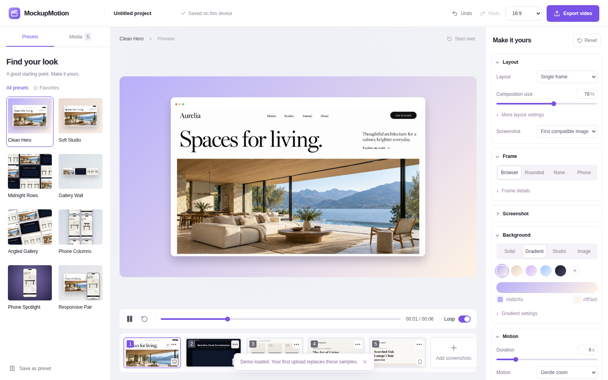
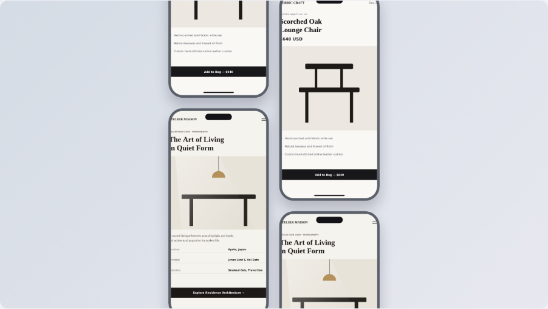
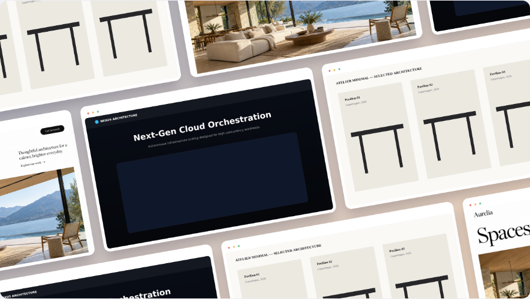
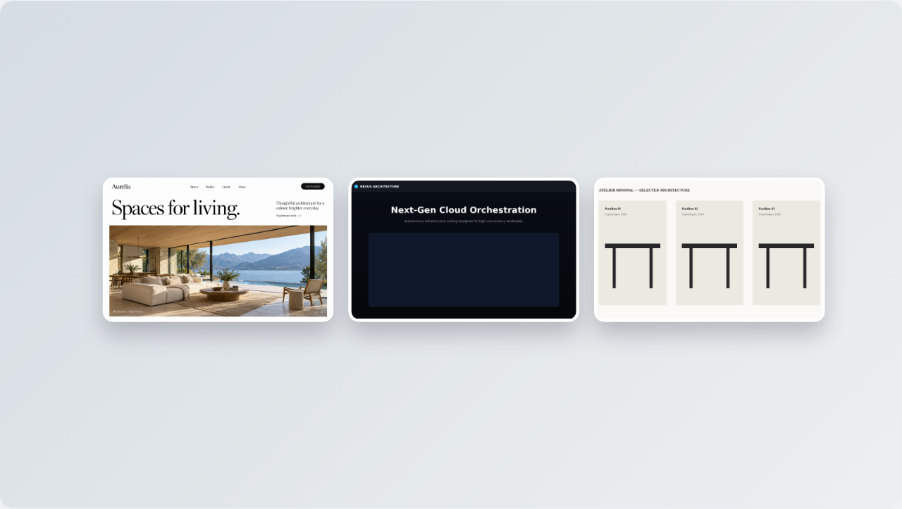
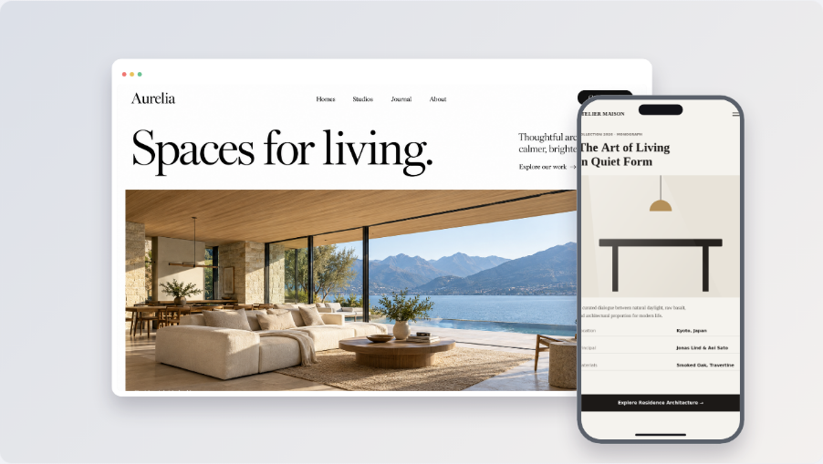

# Audit of MockupMotion v0.1 (October 2026)

## Method

- Read every source file: about 6,500 lines across `src/`, `tests/`, and config.
- Ran `npm ci`, `npm test` (10/10 pass), and `npm run build` (passes).
- Drove the app in headless Chromium. Loaded the demo, applied all 8 presets, captured the preview at t = 0 and mid-loop, and checked the 390 px mobile layout.
- Ran a real export: 1920 × 1080, 30 FPS, 6 s. It completed in 6.4 s and produced 5.6 MB of WebM (Playwright Chromium has no H.264, so MP4 falls back to WebM correctly).

The plumbing works. The output looks cheap, and the reasons are mostly structural, not small tuning problems.

## 1. Why the output looks cheap (ranked by impact)

| # | Problem | Evidence | Root cause |
|---|---|---|---|
| 1 | **Motion is almost invisible, and when visible it yo-yos.** "Gentle zoom" peaks at 2.4% and then zooms back out. "Drift" moves about 18 px. Rows and columns slide forward and then slide back. | `src/rendering/geometry.ts:351-360`: loop mode maps progress through `(1 - cos 2πp)/2`, which goes 0→1→0. `src/rendering/renderer.ts:299-304`: zoom `1 + p·amount·0.2`, so 12% becomes 1.024. | The motion model is a single scalar `p` multiplied by tiny constants. There are no camera moves, no easing vocabulary, and no staging (entrances, holds, overlapping action). |
| 2 | **Everything is flat 2D.** "Angled Gallery" is an in-plane rotation, not a perspective tilt. There is no depth, parallax, or lens. | `docs/plan/audit/angled-gallery-flat-rotation.png`. Canvas 2D only supports affine transforms. | Canvas 2D cannot draw perspective. The tilted, isometric, and floating-device looks that define Jitter and shots.so need a 3D renderer. |
| 3 | **Mobile screenshots are cropped on the sides inside phones.** "ATELIER MAISON" renders as "TELIER MAISON". | `docs/plan/audit/phone-columns-side-crop.png`. `renderer.ts:157-162` gives a phone screen aspect of about 0.45. `geometry.ts:332-350` `cover` fit scales a 0.5625 image by height and crops width. | The image-fit model does not know that website content must fit width. |
| 4 | **Device frames look like placeholders.** The phone is a flat grey slab with a notch drawn over the content and no side buttons or edge highlight. The browser frame has tiny dots, no URL bar, and a white strip. | `renderer.ts:117-221` | Hand-drawn primitives with magic numbers and one fill color. |
| 5 | **Demo content looks like wireframes.** Seven of the eight demo screens are Canvas-drawn mockups ("TT" table icons, an empty dark box under "Next-Gen Cloud Orchestration"). Preset thumbnails use them too, so the first impression of every preset is poor. | `src/utils/sampleImages.ts` (705 lines). `docs/plan/audit/midnight-rows.png` | Only `public/demo/aurelia.png` is real-looking content. |
| 6 | **Weak composition.** Gallery Wall with 3 images renders three small cards in a sea of background. Rows and columns repeat the same screenshot on a diagonal. | `docs/plan/audit/gallery-wall-empty-space.png`. `renderer.ts:379-388`, `get(row + col)` at `:419` and `:445` | No layout rules (fill ratios, minimum sizes, repetition avoidance). |
| 7 | **Single-layer, uniformly grey shadows, and a "reflection" that washes out the screenshot.** | `renderer.ts:135-144`, `:176-185` | No contact shadow, no ambient layer, no tint from the background. |
| 8 | **Typography is Arial everywhere on the canvas.** Title, subtitle, browser title, and status bar text are all fixed Arial at fixed positions. | `renderer.ts:59, 202, 215, 234` | Branding was an afterthought. A web designer needs real fonts. |
| 9 | **The preview is soft on retina screens.** The canvas is always 1280 × 720 and CSS upscales it about 1.4× at 2× DPR. | `src/editor/Preview.tsx:247` | The preview is not DPR-aware, and users judge quality by the preview. |
| 10 | **Banding risk in exports.** Smooth gradients and dark spotlight backgrounds get 8-bit H.264 at 10 Mbps (1080p30 "high") with no dither or grain. | `src/export/encode.ts:352-358` | No anti-banding strategy. |

## 2. Functional bugs and inconsistencies

| Where | Issue |
|---|---|
| `renderer.ts:263` | The logical canvas is 1280 wide for landscape and square, and 720 wide for portrait. So 1:1 and 4:5 render the same settings at different relative sizes, and px-based shadow, spacing, and border values change apparent weight between ratios. |
| `geometry.ts:375-388` | `chooseImages` silently falls back to any image, so a desktop screenshot can end up in a phone. |
| `geometry.ts:389-394` | `canScroll` hardcodes frame ratios (0.48, 1.6) that do not match the screen rect actually drawn (padding and browser bar). |
| `renderer.ts:207-212` | The notch and home bar draw over screenshot content, with no status-bar safe area. |
| `Presets.tsx:44-46` | Preset thumbnails render at 300 × 240 (5:4) whatever the project ratio, so a thumbnail does not show what you will get. |
| `App.tsx:264`, `Controls.tsx` `TextField` | Every keystroke in the project name or a text field is a separate undo step. |
| `storage/projects.ts:543-558` with `useEditor.ts:53-71` | Every edit (500 ms debounce) rewrites the whole project, including every image blob. Blobs should be stored once per asset. |
| `Presets.tsx:56-78` | Animated thumbnails only respond to mouse hover, not keyboard focus. |
| `index.html:15-17` | The UI font comes from the Google Fonts CDN, which contradicts local-first and offline use. |
| `export/video.ts:95-196` | The MediaRecorder fallback records in real time and is non-deterministic. Every 2026 target browser (Chrome, Edge, Safari 17+, Firefox 130+) has WebCodecs, so it is dead weight. |
| — | Only one project ("current"). "Start over" wipes it, and that can only be undone in the same session. |

## 3. UX and UI design

- **Generic "AI SaaS" look.** Lavender gradients, a purple accent (`#7952e7`), and cute copy ("Find your look", "Make it yours", "Ready for its close-up."). Designers will read it as a template. Tools in this category (Jitter, Rotato, Screen Studio, Figma) use a quiet neutral UI, usually dark, so the canvas carries the color.
- **The canvas is not the hero.** Two sidebars (280 px + 300 px), a breadcrumb that says "Clean Hero › Preview", a "Start over" button in a prime spot, a playback bar, and a media strip all compete with the preview.
- **No timeline.** A video tool without a timeline feels like a toy. A minimum is a storyboard of shots with durations and transitions.
- **The inspector is a long scroll of native controls.** It uses `<select>` and `<input type=color>`, px-based sliders for shadow blur and offset, and settings that only make sense for some layouts.
- **The media strip duplicates the Media tab.**
- **On mobile**, the empty state floats in a large blank area.
- **Tailwind is installed and imported but not used anywhere.** All styling lives in a 1,715-line hand-written `index.css`.

## 4. Code and architecture

- **Monolithic renderer.** `renderScene` is one 200-line function with layout branches and a 10-parameter `frame()` helper. Adding a layout means editing everything.
- **A flat `Composition` mixes layout-specific settings** (`count`, `rotation`, `alignment`, phone `finish`) with global style. Presets are mutations of one default object.
- **`App.tsx` (567 lines)** owns every handler and prop-drills into panels.
- **No single source of truth for geometry.** `canScroll` and the renderer compute screen rects differently.
- **Leftovers from the Google AI Studio scaffold:** `metadata.json`, `DISABLE_HMR` comments in `vite.config.ts`, an `@` alias pointing at the repo root, and `experimentalDecorators` and `allowJs` in `tsconfig.json`.
- **"Lint" is just `tsc`.** There is no ESLint and no React hooks rules. The code is written in a compressed style with comma-chained declarations that is hard to review.
- **`docs/DESIGN.md` and `IMPLEMENTATION_PLAN.md` claimed everything was done.** They are now archived in `docs/archive/` so agents do not trust them.

## 5. What is worth keeping

| Keep | Why |
|---|---|
| **Mediabunny export in a Web Worker with codec probing** (`src/export/encode.ts`, `video.worker.ts`, `probeExport`) | Verified working, fast (about 1× realtime at 1080p in headless Chromium), with correct format metadata and cancellation. WP-16 refactors it; do not rewrite it. |
| **The rendering contract "project + time + size → frame"** | It is the right foundation. The plan keeps it and makes it explicit (`evaluate()` → `Engine.renderAt()`). |
| **Local-first IndexedDB persistence, undo transactions** (`begin`/`end` around slider drags), **and the `history.ts` module and its tests** | Correct semantics. They get a better store and schema in WP-01. |
| **Image validation** (type, 35 MB cap, 80 MP cap) | Sensible limits. |
| **`public/demo/aurelia.png`** | The one good demo asset. Reuse it inside the new demo sites (WP-04). |

## 6. Screenshot evidence

| | |
|---|---|
|  Phone columns: side-cropped screenshots, flat device, diagonal repetition. |  Angled gallery: in-plane rotation, no perspective, wireframe demo content. |
|  Gallery wall: three small cards and about 70% empty background. |  Responsive pair: the best of the eight, but the phone content is side-cropped and the frames are placeholder quality. |
